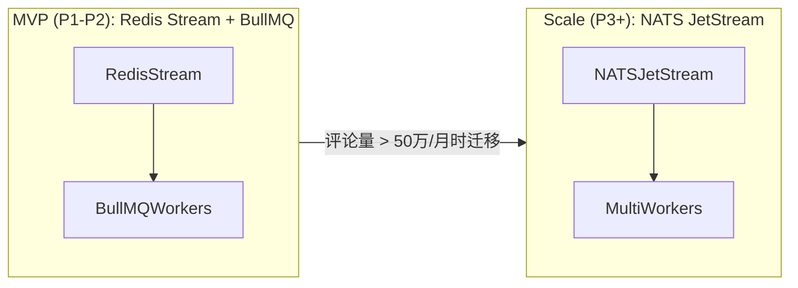

# Comment Copilot - 技术架构文档

> 目标：以“稳定采集 + AI 编排 + 安全回路 + 数据闭环”四层能力，为内容创作者与运营团队提供高可用的评论转化基础设施。

最后更新：2026-03-11（v1.1 优化版）

---

## 1. 系统总览

### 1.1 逻辑架构

```
┌──────────┐    ┌─────────────┐    ┌──────────┐    ┌────────────┐
│  Chrome  │    │  API / BFF  │    │  AI Flow │    │ Data Layer │
│  Plugin  │──▶ │  (NestJS)   │──▶ │ Orchestr.│──▶ │ (PG / S3)  │
└──────────┘    └─────────────┘    └──────────┘    └────────────┘
      │                │                    │              │
      ▼                ▼                    ▼              ▼
 WebSocket/UI   Queue Workers        Model Router    Analytics/BI
```

关键模块：

1. **Chrome/Edge 插件**：采集评论、注入浮层、执行本地审核动作。
2. **API/BFF**：认证、配置、人设管理、评论处理、Webhook/通知。
3. **AI Orchestrator**：意图识别、回复生成、私信脚本、风控策略执行。
4. **数据层**：PostgreSQL（事务数据）、Redis（队列/SLA 计时）、对象存储（训练/报表）。
5. **监控与可观测性**：Prometheus + Grafana + Loki，追踪抓取成功率、模型延迟等指标。

### 1.2 环境与部署

- 环境：`dev`（开发内测）、`staging`（灰度/沙盒）、`prod`（正式）。
- 部署：Kubernetes 集群（EKS/GKE），通过 GitHub Actions → ArgoCD 滚动发布。
- 隔离：每个租户数据隔离在逻辑 schema，敏感配置使用 Vault/KMS 管理。
- 弹性：API/Workers 水平扩展，AI 服务通过简单的 AI Router 服务转发至 OpenAI / DeepSeek 官方 API（不自托管模型）。

---

## 2. 数据采集与同步链路

### 2.1 插件抓取流程

1. DOM Watcher 监听评论列表增量，使用 MutationObserver + 节流策略。
2. 解析结构化字段（评论 ID、父评论、作者、时间、文本、媒体）。
3. 本地去重（Bloom Filter）后写入 IndexedDB，按批次（≤50 条）加密（AES-GCM）并发送至 Backend `/ingest/comments`。
4. 失败重试：指数退避 + 离线缓存；网络恢复后补发，带幂等 key（comment_id + platform）。
5. 限频：依据平台策略控制请求速率（默认 1 req / 2s），高峰期启用「只拉取高优先级评论」。

### 2.2 服务端处理

```
Plugin ▶ Ingest API ▶ Redis Stream ▶ ETL Worker ▶ PostgreSQL
                                     │
                                     └▶ BullMQ (队列任务) ▶ AI Flow
```

- Ingest API 校验签名、校准时间戳、写入 Redis Stream。
- ETL Worker 执行：清洗（去 emoji 垃圾）、语言检测、追加账号上下文。
- 可靠性：Redis 持久化 + AOF；Worker 成功写库后 ack stream。
- 延迟目标：P95 < 3s（评论到落库）。

### 2.3 事件总线演进路线

MVP 阶段不额外引入 Kafka/NATS，直接使用 Redis Stream + BullMQ 承载事件；当评论量 >50 万条/月时，再评估迁移到 NATS JetStream。



---

## 3. AI 工作流与模型编排

### 3.1 Pipeline 时序

```
评论事件 → 垃圾检测 (规则+模型) → 意图识别 → 人设模版渲染 →
风险审查 (敏感词/限流) → 生成候选回复 → 审核/发送 → 反馈回写
```

### 3.2 模型与策略

| 能力 | 模型/组件 | 说明 | 降级策略 |
|---|---|---|---|
| 垃圾过滤 | FastText / TinyBERT | 快速识别广告、敏感词 | 回退至规则库 |
| 意图识别 | DeepSeek-V3 | 多语语义理解，输出多标签 | 热备 mini 模型 + keyword boost |
| 回复生成 | DeepSeek-V3（中文）；GPT-4o（多语言/英文） | 中文评论默认走 DeepSeek；非中文评论走 GPT-4o；均注入人设和限流提示 | 回退至模板库/历史高赞回复 |
| 私信脚本 | GPT-4o (长形式) | 多轮对话脚本、留资指引 | 预置 SOP 模块 |

Prompt/模板管理：

- 在 Config 服务维护人设（语气、禁用词、CTA），模型调用时注入。
- 历史互动次数、用户画像等简单特征通过 Redis Hash 提供（例如 `user:{author_id}:stats`，TTL 30 天）。
- 记录每次模型输入/输出，写入审计表与 `ai_call_logs` 表，便于复现与成本分析。

监控：

- 延迟：P95 < 6s（生成回复）。
- 成本：每账号月度成本预算，超出自动切换至更便宜模型。
- 质量：人工抽检、thumbs-up/down 回流训练。

---

## 4. 数据模型与事件总线

### 4.1 核心表（PostgreSQL）

| 表名 | 关键字段 | 说明 |
|---|---|---|
| `accounts` | id, platform, credentials_ref, status | 平台账号与授权信息 |
| `personas` | id, account_id, tone, keywords, blocked_words | 人设配置与模版 |
| `comments` | id, platform_comment_id, video_id, author, content, status | 原始评论及处理状态 |
| `leads` | id, comment_id, intent_level, owner_id, funnel_stage | 潜客信息与分配 |
| `tasks` | id, type, payload, retry_count, next_run_at | Worker 任务 & SLA 计时 |
| `audit_logs` | id, actor_id, resource, action, payload | 操作留痕，满足合规 |
| `reports` | id, account_id, period, metrics_json | 周报、爆款分析缓存 |

### 4.2 事件驱动

MVP 阶段：不单独部署 Kafka/NATS，统一通过 Redis Stream + BullMQ 承载事件；后续如需多语言消费者和更强持久化，再评估引入 NATS JetStream。

当前事件主题：

- `comment.ingested`：新评论写库 → 触发 AI Pipeline。
- `intent.scored`：潜客评分生成 → 通知 Lead 队列。
- `reply.sent`：评论/私信发送成功 → 更新状态、写入报表。
- `alert.sla`：SLA 超时 → 推送到通知中心。

消费者：AI 服务、通知服务、报表服务、监控告警服务。所有事件使用 JSON Schema 注册，便于版本控制。

---

## 5. 后台服务与实时推送

### 5.1 服务组件

| 组件 | 技术 | 说明 |
|---|---|---|
| API Gateway | NestJS + REST | 暴露插件/Web Admin/API，负责鉴权、限流 |
| Comment Worker | Node.js / NestJS Workers + BullMQ | 处理清洗、入库、调用 AI 管道 |
| Scheduler | BullMQ + Cron | SLA 定时器、周报生成、重试任务 |
| Notification Center | Webhook + SMTP + 钉钉/企微机器人 | 统一发送告警、提醒 |
| WebSocket Hub | Socket.IO + Redis Adapter | 多节点广播评论、AI 回复、潜客更新 |

### 5.2 推送流程与 WebSocket 鉴权

1. Web Admin / 插件在握手时通过 query string 携带 JWT：`wss://api.example.com/ws?token=xxx`。
2. WebSocket Hub 在握手阶段验证 JWT，提取 `tenantId`/`userId`，将连接加入对应房间（如 `tenant:{id}`）。
3. Worker 将处理结果写入 Redis Pub/Sub 或通过 Socket.IO Adapter 直接推送到指定房间。
4. 大量连接时使用 Sticky Session + Redis Cluster 保障水平扩展。
5. 对于离线用户，Notification Center 通过邮件/企微发送摘要。

---

## 6. 安全、合规与风控

1. **RBAC**：角色（管理员/运营/审核/访客）控制数据访问与操作权限。
2. **认证**：插件与服务间使用 OAuth2 + HMAC 签名；刷新令牌以 12 小时为周期。
3. **数据保护**：
   - 传输加密 HTTPS/TLS1.3。
   - 静态数据：PG TDE + KMS，加密敏感列（手机号、留资链接）。
   - 审计：所有自动发送动作写入 `audit_logs`。
4. **风控策略**：
   - 默认人工复核，管理员可为信任账号开启「半自动模式」。
   - 发送频率：评论 ≥30s、私信 ≥60s，可配置阈值。
   - **模拟真实浏览器**：仅用于测试环境，通过 Playwright + Stealth 插件 + Rotating Proxy 进行 E2E 测试，不在生产环境自动发送评论/私信。\n   - 生产环境发送评论/私信：通过用户浏览器内的插件注入 DOM 操作，由真实用户会话执行。
   - 异常检测：平台返回 `rate_limit`/`ban` 时自动降级为人工模式并告警。

---

## 2.x 多平台 DOM 适配与 selector 热更新

- 每个平台维护独立 selector 配置文件（JSON），示例：`selector.xiaohongshu.json`, `selector.douyin.json`。
- 配置项包括：评论列表节点、作者名、评论内容、时间戳、评论 ID 等 CSS 选择器。
- 配置存储在服务端 Config 服务中，支持版本号（如 `v2026.03.11`）。\n- 插件启动时从 API 拉取当前平台 selector 配置，缓存到本地，避免频繁请求。\n- 当 DOM 结构变动导致抓取失败时，可仅在服务端更新 selector 配置，无需重新发布插件。

---

## 7. 可扩展性与路线图

### 7.1 多平台/多地区

- 抽象 `PlatformAdapter` 接口（登录、评论定位、字段映射），通过配置驱动新增平台。
- 插件层按平台注入差异化脚本，服务层通过 `accounts.platform` 控制分支。
- 数据隐私：支持按地区落地（例如国内/海外分库），S3 bucket 按区域隔离。

### 7.2 技术演进

| 阶段 | 能力 | 备注 |
|---|---|---|
| T+1 | 多租户隔离、队列优先级 | 服务更多 MCN / 品牌 |
| T+2 | 模型自训练（蒸馏 + RLHF） | 基于用户反馈优化回复质量 |
| T+3 | 插件跨浏览器（Firefox/Edge） | 扩展用户覆盖 |

技术债：

1. 当前事件总线尚未集群部署，需要纳入 HA 计划。
2. 报表服务依赖离线批处理，需引入流式指标计算。
3. AI 成本监控尚为手动报表，需自动化入口。

---

## 8. 监控与运维

- **指标**：
  - 抓取成功率、落库延迟、AI Pipeline 延迟/失败率、发送成功率、SLA 告警数量。
  - 成本指标：模型调用次数、平均 token 消耗。
- **日志**：
  - 插件：使用 Sentry 捕获前端错误；
  - 服务端：结构化日志输出至 Loki，按 trace_id 贯通。
- **告警策略**：
  - P0：抓取成功率 <70% 或 AI 失败率 >30% → PagerDuty。
  - P1：WebSocket 断开率 >10% → 邮件 + 钉钉。
  - P2：单账号限流 → 通知账号负责人。

---

## 9. 附录：关键时序示例

```
用户评论 → 插件捕获 (t0)
  → 发送 Ingest API (t0+0.5s)
  → Redis Stream 入队 (t0+0.8s)
  → Worker 清洗/写库 (t0+1.5s)
  → AI Pipeline 生成回复 (t0+4s)
  → 审核通过 / 插件推送 (t0+5s)
  → Reply Sent 事件 → 数据看板 (t0+6s)
```

该流程在 P95 场景下保持 6 秒内闭环，满足「高意向评论 2h 内处理」的体验目标。