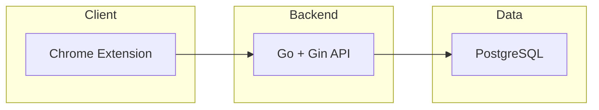

# Comment Copilot — 已实现技术架构

> 面向后端协作者：描述当前仓库内已实现的后端边界、目录、API 与数据流。

最后更新：2026-03-11

- **使用逻辑与用户动线**见 [usage-flow.md](usage-flow.md)。
- **完整文档索引与架构审阅**见 [README.md](README.md)、[architecture-review-note-comment-and-docs.md](architecture-review-note-comment-and-docs.md)。

---

## 1. 系统边界（已实现）

当前后端链路：Chrome Extension (Plasmo) → Go 后端 (Gin) → PostgreSQL。



> **已移除**：原 Next.js Web 后端（`web/`）与 NestJS（`services/api/`）均已删除，当前仅保留 Go 后端。

---

## 2. 后端目录与职责

| 路径 | 职责 |
|------|------|
| `backend/cmd/server/main.go` | 入口：加载配置、连接 DB、注册路由、启动服务 |
| `backend/cmd/migrate/main.go` | 迁移入口：执行 migrations 目录下的 SQL 文件 |
| `backend/internal/handler/` | HTTP 处理器（薄层，参数校验 + 调用 service） |
| `backend/internal/service/` | 业务逻辑 |
| `backend/internal/repository/` | 数据库访问（GORM） |
| `backend/internal/middleware/` | JWT 鉴权（RequireAuth）、租户校验（RequireTenantMatch） |
| `backend/internal/server/` | 路由注册与 CORS 配置 |
| `backend/internal/db/` | DB 连接、GORM 模型、AutoMigrate |
| `backend/internal/config/` | 配置加载（config.yaml via Viper） |
| `backend/migrations/` | SQL 迁移文件（手动执行或 auto_migrate） |

### 2.1 API 路由一览

| 路径 | 方法 | 说明 |
|------|------|------|
| `/api/health` | GET | 健康检查（当前注册在 JWT 保护组内，**需 Bearer**） |
| `/api/auth/register` | POST | 用户注册（创建 tenant + user） |
| `/api/auth/login` | POST | 登录，返回 JWT token |
| `/api/auth/logout` | POST | 登出（JWT 无状态，客户端清除即可） |
| `/api/auth/me` | GET | 获取当前用户信息（含积分，需 JWT） |
| `/api/comments` | GET | 评论列表查询（需 JWT + x-tenant-id） |
| `/api/ingest/comments` | POST | 评论入库（插件上报，需 JWT + x-tenant-id） |
| `/api/comments/mark-replied` | POST | 标记评论已回复（需 JWT + x-tenant-id） |
| `/api/saved-replies` | GET/POST | 存言列表/新建（需 JWT + x-tenant-id） |
| `/api/saved-replies/:id` | DELETE | 删除存言（需 JWT + x-tenant-id） |
| `/api/selectors` | GET | 平台 DOM 选择器配置 |
| `/api/ai/reply` | POST | AI 回复生成（DeepSeek，扣积分，需 JWT + x-tenant-id） |
| `/api/ai/note-comment` | POST | 笔记主跟评文案生成（DeepSeek，扣积分；契约见 [plan-note-comment-api-independent-route.md](plan-note-comment-api-independent-route.md)） |
| `/api/settings/persona` | GET/POST | 人设读取/保存（需 JWT） |

### 2.2 数据库与迁移

- 连接：`backend/internal/db/db.go`（GORM + pgx 驱动）。
- 模型：`backend/internal/db/models.go`。
- 迁移：`backend/migrations/`；`config.yaml` 中 `auto_migrate: true` 时启动自动建表，生产环境建议手动执行 SQL 文件。

---

## 3. 已实现 API 契约摘要

| 接口 | 方法 | 鉴权 | 请求要点 | 响应要点 |
|------|------|------|----------|----------|
| `/api/auth/register` | POST | 无 | `{ email, password, name? }` | `{ ok, userId, tenantId }` |
| `/api/auth/login` | POST | 无 | `{ email, password }` | `{ token }` |
| `/api/auth/me` | GET | JWT Bearer | — | `{ ok, user: { id, email, name }, points: { freeBalance, freeQuota, topupBalance, total } }` |
| `/api/ingest/comments` | POST | JWT + x-tenant-id | `{ platform, comments[] }` 每项含 `platformCommentId`, `authorName`, `content`, `commentedAt`, `postUrl?`, `isAuthorReply?` | `{ ok, saved, skipped }` |
| `/api/ai/reply` | POST | JWT + x-tenant-id | `{ commentId, commentContent, persona?, postTitle?, postContent? }` | `{ ok, suggestions[] }`；积分不足返回 402；**handler 内不写库** |
| `/api/ai/note-comment` | POST | JWT + x-tenant-id | `{ postUrl?, postTitle?, postContent?, persona?, style? }`（三者不能全空） | `{ ok, suggestions[] }`；积分不足 402；**handler 内不写库** |
| `/api/comments` | GET | JWT + x-tenant-id | Query: `intent`, `status`, `postUrl`, `limit` | `{ ok, data: Comment[], total }` |
| `/api/comments/mark-replied` | POST | JWT + x-tenant-id | `{ commentId }` | `{ ok }` |
| `/api/saved-replies` | GET | JWT + x-tenant-id | Query: `category`, `search`, `limit` | `{ ok, data: SavedReply[] }` |
| `/api/saved-replies` | POST | JWT + x-tenant-id | `{ text, fromCommentId?, fromCommentSnippet?, category? }` | `{ ok, data: SavedReply }` |
| `/api/saved-replies/:id` | DELETE | JWT + x-tenant-id | — | `{ ok }` |
| `/api/selectors` | GET | JWT + x-tenant-id | Query: `platform` | `{ ok, platform, version, selectors }` |
| `/api/settings/persona` | GET | JWT Bearer | — | `{ ok, persona }` |
| `/api/settings/persona` | POST | JWT Bearer | `{ keywords, autoGenerate? }` | `{ ok, persona }` |
| `/api/health` | GET | JWT Bearer | — | `{ status: "ok" }`（与当前 `router` 一致） |

---

## 4. 数据流（已实现）

### 4.1 评论采集

```
Content Script (DOM) → Background → POST /api/ingest/comments (JWT)
  → 校验 platform、comments[]
  → 按 (tenantId, platform, platformCommentId) 去重
  → 插入 comments
  → 返回 { saved, skipped }
```

### 4.2 AI 回复（与 `ai_handler.Reply` 实现一致）

```
Sidepanel / Background → POST /api/ai/reply (JWT + x-tenant-id)
  → 校验 commentId、commentContent（及租户头）
  → 若未配置 deepseek_api_key：返回 mock suggestions，不扣费
  → 否则：扣积分（优先免费积分，不足返回 402）
  → 调用 DeepSeek Chat Completions（JSON 格式），解析 suggestions
  → 返回 { ok, suggestions }；任一步失败则 RefundPoints
```

> **说明**：当前 `Reply` handler **不**写入 `ai_replies`、**不**更新 `comments.status`。评论「已回复」若需与后端一致，见插件侧本地方案与后续 [todo_v1_reply_status_sync.md](todo_v1_reply_status_sync.md)；可选调用 `POST /api/comments/mark-replied`。

### 4.2b 笔记跟评（与 `ai_handler.NoteComment` + 扩展智言「笔记跟评」一致）

```
Sidepanel → GET_POST_CONTENT（content：标题/正文/postUrl）
  → Background → POST /api/ai/note-comment (JWT + x-tenant-id)
  → 扣积分 / DeepSeek / 解析 suggestions（与 reply 类似）
  → 用户点「评论」→ FILL_NOTE_COMMENT → content script 写入笔记下方主评论输入（非回复某条评论）
```

### 4.3 标记评论已回复

```
扩展在用户确认已回复等时机 → POST /api/comments/mark-replied (JWT + x-tenant-id)
  → 更新对应评论在 DB 中的状态（与 AI 生成接口独立）
```

### 4.4 列表查询

- **侧边栏**：`GET /api/comments?postUrl=<当前页URL>`（JWT）→ 按当前帖子过滤评论。
- 支持 `intent`、`status`、`limit` 追加过滤，过滤在 SQL 层完成。

---

## 5. 认证与多租户

- **认证方式**：JWT Bearer Token（登录后由 `/api/auth/login` 下发，客户端存储并在请求头 `Authorization: Bearer <token>` 中携带）。
- **多租户**：注册时自动创建 tenant，所有业务表带 `tenant_id`。业务 API 需在请求头携带 `x-tenant-id`，由 `RequireTenantMatch` 中间件校验与用户归属一致。
- **插件侧**：登录后把 token 和 tenantId 存入 `@plasmohq/storage`，每次请求附加 `Authorization` 和 `x-tenant-id`。
- **积分系统**：`users` 表含 `free_points_balance`、`topup_points_balance`，注册送 2000 免费积分；AI 调用每次扣 1 积分，不足返回 402。

---

## 6. 插件目录

| 路径 | 职责 |
|------|------|
| `apps/extension/constants.ts` | 各平台 URL 判定、`canonicalDouyinPostUrl`、侧栏拉取去重 key 等 |
| `apps/extension/constants.test.ts` | URL / platform 单测（Vitest） |
| `apps/extension/contents/shared/platform-content-utils.ts` | 三端共用：ingest 去重、节流扫描、hash |
| `apps/extension/contents/xiaohongshu.ts` | 小红书：DOM 采集、滚动同步、填入回复/主评 |
| `apps/extension/contents/bilibili.ts` | 哔哩哔哩视频页：同上 |
| `apps/extension/contents/douyin.ts` | 抖音 Web（信息流壳层 + `/video` / `modal_id`）：采集、跟评、滚动同步 |
| `apps/extension/sidepanel/index.tsx` | 侧边栏 UI（智言、存言、灵主、驭灵）；`tabs.onUpdated` 与当前标签同步 |
| `apps/extension/sidepanel/legal-content.tsx` | 服务条款、隐私政策内容 |
| `apps/extension/sidepanel/legal-modal.tsx` | 法律文档弹窗组件 |
| `apps/extension/sidepanel/login-view.tsx` | 登录/注册页（含法律条款入口） |
| `apps/extension/background.ts` | 消息路由、API 请求代理、Side Panel 入口 |
| `apps/extension/auth/Login.tsx` | 登录 UI 组件（备用） |
| `apps/extension/auth/Register.tsx` | 注册 UI 组件（备用） |

**意见反馈**：驭灵 → 关于 → 意见反馈，跳转 GitHub Issues（`PLASMO_PUBLIC_GITHUB_REPO` 或 `PLASMO_PUBLIC_FEEDBACK_URL` 可配置）。
