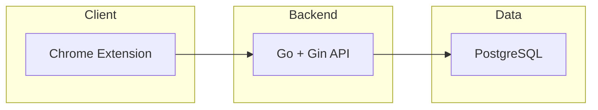

# Comment Copilot — 已实现技术架构

> 面向后端协作者：描述当前仓库内已实现的后端边界、目录、API 与数据流。

最后更新：2026-03-14

- **使用逻辑与用户动线**见 [usage-flow.md](usage-flow.md)。

---

## 1. 系统边界（已实现）

当前后端链路：Chrome Extension (Plasmo) → Go 后端 (Gin) → PostgreSQL。



> **已移除**：原 Next.js Web 后端（`web/`）与 NestJS（`services/api/`）均已删除，当前仅保留 Go 后端。

---

## 2. 后端目录与职责

| 路径 | 职责 |
|------|------|
| `backend/cmd/server/main.go` | 入口：加载配置、连接 DB、注册路由、启动服务 |
| `backend/internal/handler/` | HTTP 处理器（薄层，参数校验 + 调用 service） |
| `backend/internal/service/` | 业务逻辑 |
| `backend/internal/repository/` | 数据库访问（GORM） |
| `backend/internal/middleware/` | JWT 鉴权中间件 |
| `backend/internal/server/` | 路由注册与 CORS 配置 |
| `backend/internal/db/` | DB 连接、GORM 模型、AutoMigrate |
| `backend/internal/config/` | 配置加载（config.yaml via Viper） |
| `backend/migrations/` | SQL 迁移文件（手动执行或 auto_migrate） |

### 2.1 API 路由一览

| 路径 | 方法 | 说明 |
|------|------|------|
| `/api/health` | GET | 健康检查 |
| `/api/auth/register` | POST | 用户注册（创建 tenant + user） |
| `/api/auth/login` | POST | 登录，返回 JWT token |
| `/api/auth/logout` | POST | 登出（JWT 无状态，客户端清除即可） |
| `/api/auth/me` | GET | 获取当前用户信息（需 JWT） |
| `/api/comments` | GET | 评论列表查询（需 JWT） |
| `/api/ingest/comments` | POST | 评论入库（插件上报，需 JWT） |
| `/api/selectors` | GET | 平台 DOM 选择器配置 |
| `/api/ai/reply` | POST | AI 回复生成（DeepSeek，需 JWT） |
| `/api/settings/persona` | GET/POST | 人设读取/保存（需 JWT） |

### 2.2 数据库与迁移

- 连接：`backend/internal/db/db.go`（GORM + pgx 驱动）。
- 模型：`backend/internal/db/models.go`。
- 迁移：`backend/migrations/`；`config.yaml` 中 `auto_migrate: true` 时启动自动建表，生产环境建议手动执行 SQL 文件。

---

## 3. 已实现 API 契约摘要

| 接口 | 方法 | 鉴权 | 请求要点 | 响应要点 |
|------|------|------|----------|----------|
| `/api/auth/register` | POST | 无 | `{ email, password, name? }` | `{ ok, userId, tenantId }` |
| `/api/auth/login` | POST | 无 | `{ email, password }` | `{ token }` |
| `/api/auth/me` | GET | JWT Bearer | — | `{ id, email, tenantId }` |
| `/api/ingest/comments` | POST | JWT Bearer | `{ platform, comments[] }` 每项含 `platformCommentId`, `authorName`, `content`, `commentedAt`, `postUrl?`, `isAuthorReply?` | `{ ok, saved, skipped }` |
| `/api/ai/reply` | POST | JWT Bearer | `{ commentId, commentContent, persona? }` | `{ ok, suggestions[] }` |
| `/api/comments` | GET | JWT Bearer | Query: `intent`, `status`, `postUrl`, `limit` | `{ ok, data: Comment[], total }` |
| `/api/selectors` | GET | 无 | Query: `platform` | `{ ok, platform, version, selectors }` |
| `/api/settings/persona` | GET | JWT Bearer | — | `{ ok, persona }` |
| `/api/settings/persona` | POST | JWT Bearer | `{ keywords, autoGenerate? }` | `{ ok, persona }` |
| `/api/health` | GET | 无 | — | `{ status: "ok" }` |

---

## 4. 数据流（已实现）

### 4.1 评论采集

```
Content Script (DOM) → Background → POST /api/ingest/comments (JWT)
  → 校验 platform、comments[]
  → 按 (tenantId, platform, platformCommentId) 去重
  → 插入 comments
  → 返回 { saved, skipped }
```

### 4.2 AI 回复

```
Sidepanel / Background → POST /api/ai/reply (JWT)
  → 校验 commentId、commentContent
  → 读取 tenants.persona
  → 调用 DeepSeek API，解析 JSON suggestions
  → 写入 ai_replies，更新 comments.status = 'replied'
  → 返回 { ok, suggestions }
```

### 4.3 列表查询

- **侧边栏**：`GET /api/comments?postUrl=<当前页URL>`（JWT）→ 按当前帖子过滤评论。
- 支持 `intent`、`status`、`limit` 追加过滤，过滤在 SQL 层完成。

---

## 5. 认证与多租户

- **认证方式**：JWT Bearer Token（登录后由 `/api/auth/login` 下发，客户端存储并在请求头 `Authorization: Bearer <token>` 中携带）。
- **多租户**：注册时自动创建 tenant，所有业务表带 `tenant_id`，查询时强制按当前 token 对应租户过滤。
- **插件侧**：登录后把 token 存入 `@plasmohq/storage`，每次请求从 storage 读取并附加到请求头。

---

## 6. 插件目录

| 路径 | 职责 |
|------|------|
| `apps/extension/contents/xiaohongshu.ts` | DOM 解析、评论采集、滚动同步 |
| `apps/extension/sidepanel/index.tsx` | 侧边栏 UI（虚拟列表、滚动联动） |
| `apps/extension/background.ts` | 消息路由、API 请求代理 |
| `apps/extension/auth/Login.tsx` | 登录 UI 组件（备用，供后续插件内登录） |
| `apps/extension/auth/Register.tsx` | 注册 UI 组件（备用） |
