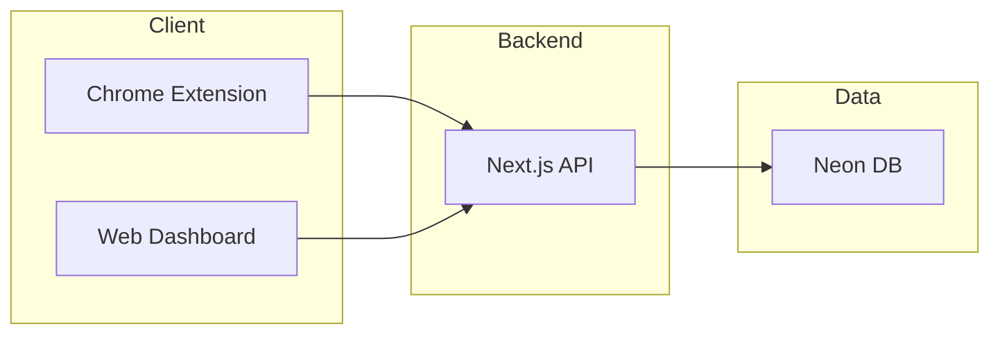

# Comment Copilot — 已实现技术架构

> 面向后端协作者：描述当前线上/仓库内已实现的后端边界、目录、API 与数据流。规划中的 Inngest/Redis 等不在此文档范围。

最后更新：2026-03-13

---

## 1. 系统边界（已实现）

当前仅存在一条后端链路：Chrome Extension (Plasmo) → Next.js (Vercel) → Neon DB。无独立 NestJS 服务、无 Redis、无 Inngest 实现。



---

## 2. 后端目录与职责

| 路径 | 职责 |
|------|------|
| `web/src/app/api/` | 所有 HTTP 入口（Route Handlers） |
| `web/src/db/` | Drizzle schema 与连接 |
| `web/src/auth.ts` | NextAuth 配置；认证后 `session.user.tenantId` 为当前租户 |

### 2.1 API 路由一览

| 路径 | 文件 | 说明 |
|------|------|------|
| `POST /api/ingest/comments` | `app/api/ingest/comments/route.ts` | 评论入库（插件上报） |
| `POST /api/ai/reply` | `app/api/ai/reply/route.ts` | AI 回复生成（DeepSeek） |
| `GET /api/comments` | `app/api/comments/route.ts` | 评论列表查询 |
| `GET /api/selectors` | `app/api/selectors/route.ts` | 平台 DOM 选择器配置 |
| `GET/POST /api/auth/[...nextauth]` | `app/api/auth/[...nextauth]/route.ts` | NextAuth 登录/会话 |
| `POST /api/auth/register` | `app/api/auth/register/route.ts` | 用户注册（创建 tenant + user） |
| `GET/POST /api/settings/persona` | `app/api/settings/persona/route.ts` | 人设读取/保存（需 session） |
| `GET /api/health` | `app/api/health/route.ts` | 健康检查 |

### 2.2 数据库与迁移

- Schema 定义：`web/src/db/schema.ts`（含 `comments.isAuthorReply` 等，与 `comment_copilot_database_schema.md` 对齐）。
- 连接：`web/src/db/index.ts`（Neon serverless 驱动）。
- 迁移文件：`web/drizzle/`；执行方式见项目 README（`npx dotenv-cli -e .env.local -- npx drizzle-kit migrate`）。

---

## 3. 已实现 API 契约摘要

| 接口 | 方法 | 鉴权 | 请求要点 | 响应要点 |
|------|------|------|----------|----------|
| `/api/ingest/comments` | POST | Header `x-tenant-id` | Body: `{ platform, comments[] }`，每项含 `platformCommentId`, `authorName`, `content`, `commentedAt`, `postUrl?`, `isAuthorReply?` | `{ ok, saved, skipped }` |
| `/api/ai/reply` | POST | Header `x-tenant-id` | Body: `{ commentId, commentContent, persona? }` | `{ ok, suggestions[] }` 或 `{ ok: false, error }` |
| `/api/comments` | GET | Header `x-tenant-id` | Query: `intent`, `status`, `limit` | `{ ok, data: Comment[], total }`，已过滤作者回复、按 `createdAt` 正序 |
| `/api/selectors` | GET | 无 | Query: `platform` | `{ ok, platform, version, selectors }` |
| `/api/auth/register` | POST | 无 | Body: `{ email, password, name? }` | `{ ok, userId, tenantId }` 或 `{ ok: false, error }` |
| `/api/settings/persona` | GET | Session | — | `{ ok, persona, name }` |
| `/api/settings/persona` | POST | Session | Body: `{ keywords, autoGenerate? }` | `{ ok, persona }` |
| `/api/health` | GET | 无 | — | `{ status: 'ok' }` |

详细请求/响应示例与错误码见 `docs/api-contract.md`。

---

## 4. 数据流（已实现）

### 4.1 评论采集

```
Content Script (DOM) → Background → POST /api/ingest/comments
  → 校验 x-tenant-id、platform、comments[]
  → 按 (tenantId, platform, platformCommentId) 去重
  → 插入 comments（isAuthorReply 写入 status 与 is_author_reply）
  → 返回 { saved, skipped }
```

### 4.2 AI 回复

```
Sidepanel / Background → POST /api/ai/reply
  → 校验 x-tenant-id、commentId、commentContent
  → 读取 tenants.persona / defaultModel
  → 调用 DeepSeek API，解析 JSON suggestions
  → 写入 ai_replies，更新 comments.status = 'replied'
  → 写入 ai_call_logs
  → 返回 { ok, suggestions }
```

### 4.3 列表与设置

- **评论列表**：Dashboard / Sidepanel → `GET /api/comments?intent=&status=&limit=`（Header `x-tenant-id`）→ 查 `comments`，过滤 `isAuthorReply`，按 `createdAt` 正序。
- **人设**：Web 设置页 → `GET/POST /api/settings/persona`（Session）→ 读/写 `tenants.persona`；POST 支持 `autoGenerate` 时调 DeepSeek 生成人设文案。

---

## 5. 认证与多租户

- **Web 控制台 / 设置页**：NextAuth.js（Credentials），Session 中 `session.user.tenantId` 即当前租户；未登录访问 `/dashboard`、`/settings` 会重定向到 `/login`。
- **插件**：无 NextAuth，使用 Header `x-tenant-id`（插件侧从 storage 或默认值读取），与 Web 登录态分离；后续可改为从 Web 下发 token 或 apiKey。
- 所有业务表带 `tenant_id`，查询时强制按当前租户过滤。

---

## 6. 遗留代码说明

- **`services/api/`（NestJS）**：早期后端，已弃用，当前未接入插件与 Web。新逻辑一律写在 `web/`，请勿在 `services/api` 上继续开发。保留或归档策略见项目 README。
