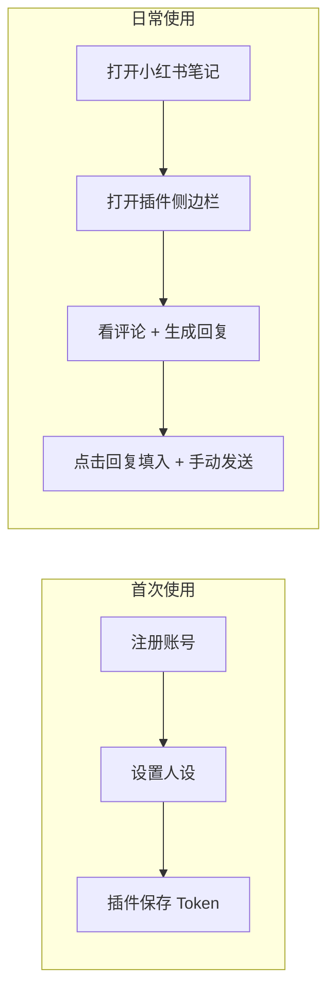

# Comment Copilot — 使用逻辑与用户动线

> 博主日常以**插件**为主；Go 后端提供 API 服务。

最后更新：2026-03-15

---

## 1. 角色与使用场景

| 角色 | 主要使用端 | 典型场景 |
|------|------------|----------|
| **博主 / 运营** | **Chrome 插件** | 在小红书笔记页边看评论边用 AI 生成回复、一键填入输入框并手动发送 |

---

## 2. 端到端使用流程

### 2.1 首次使用

1. **注册账号**  
   调用 `POST /api/auth/register`（或后续插件内注册页），用邮箱+密码注册。  
   系统会为该账号创建一个**租户（tenant）**，后续所有评论、AI 回复都归属该租户。

2. **登录获取 Token**  
   调用 `POST /api/auth/login`，返回 JWT token，保存到插件的 `@plasmohq/storage`。  
   插件所有 API 请求都会在 `Authorization: Bearer <token>` 中携带该 token。

3. **设置人设**  
   登录后调用 `POST /api/settings/persona`，填写关键词或使用「AI 生成」得到人设描述并保存。  
   插件在生成 AI 回复时会使用该人设。

4. **安装并打开插件**  
   在小红书**笔记详情页**点击浏览器工具栏的 Comment Copilot 图标，打开侧边栏。

### 2.2 日常使用（博主主流程）

1. 打开小红书，进入某篇**笔记详情页**（有评论区的那一页）。
2. 点击插件图标，打开**侧边栏**。
3. 侧边栏展示该帖子的评论（按当前页 URL 过滤）。
4. 对某条评论点击「生成 AI 回复」→ 选择一条建议 → 点击「回复」→ 文案填入小红书回复框，**用户自己在小红书页点击发送**。
5. 换一篇笔记时，侧边栏自动切换为当前笔记的评论。

全程在**插件 + 小红书页面**完成。

---

## 3. 认证方式

| 端 | 身份方式 | 说明 |
|----|----------|------|
| **插件** | JWT Bearer Token + x-tenant-id | 登录后存入 `@plasmohq/storage`，每次请求附加 `Authorization` 和 `x-tenant-id` |

- 注册/登录通过 Go 后端 `/api/auth/register` 和 `/api/auth/login` 完成。
- 所有业务 API 需在请求头携带 `Authorization: Bearer <token>` 和 `x-tenant-id`（租户校验）。
- Token 与租户绑定，所有数据按 `tenant_id` 隔离。
- **积分**：注册送 2000 免费积分，AI 调用每次扣 1 积分，不足返回 402。

---

## 4. 数据流简述

- **评论从哪里来**：仅来自**插件**。用户打开小红书笔记页，插件通过 DOM 解析采集评论并上报到 `POST /api/ingest/comments`，写入 PostgreSQL，归属当前 token 对应的租户。
- **评论到哪里去**：插件侧边栏调用 `GET /api/comments?postUrl=<当前页URL>`，只展示当前笔记的评论并触发 AI 回复。
- **人设从哪里来**：通过 `POST /api/settings/persona` 保存，存在该租户的 `tenants.persona`。插件调用 `POST /api/ai/reply` 时，后端按 token 对应租户读取 persona 生成回复。
- **存言**：用户可将 AI 回复收藏到「存言」，调用 `POST /api/saved-replies` 保存，`GET /api/saved-replies` 按分类/搜索查询，供快速复用。
- **法律与反馈**：登录/注册页底部有服务条款、隐私政策入口；驭灵 → 关于 → 意见反馈跳转 GitHub Issues。

---

## 5. 后续规划

- **插件内登录页**：`apps/extension/auth/Login.tsx` 和 `Register.tsx` 已准备好，后续可直接在插件内完成注册/登录，无需外部操作。
- **多账号管理**：Phase 3 规划中。
- **抖音支持**：Phase 2 规划中。
