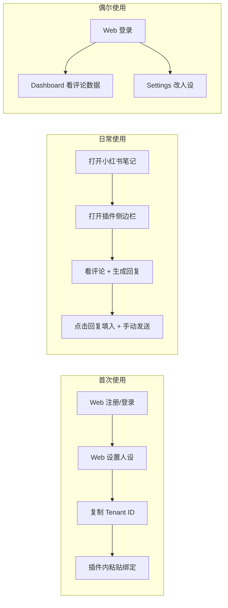

# Comment Copilot — 使用逻辑与用户动线

> 说明：博主日常以**插件**为主、**Web 后台**为阶段性数据分析；当前 Web 与插件的用户体系尚未打通，本文描述现状与推荐使用方式。

最后更新：2026-03-13

---

## 1. 角色与使用场景

| 角色 | 主要使用端 | 典型场景 |
|------|------------|----------|
| **博主 / 运营** | **Chrome 插件** | 在小红书笔记页边看评论边用 AI 生成回复、一键填入输入框并手动发送 |
| **同一人** | **Web 后台** | 偶尔打开：看一段时间内的评论数据、调整人设、后续做数据分析 |

结论：**插件 = 日常主战场，Web = 注册/设置 + 事后看数**。

---

## 2. 端到端使用流程（推荐）

### 2.1 首次使用（建议顺序）

1. **Web 注册**  
   打开 `https://你的域名/register`（或本地 `http://localhost:3000/register`），用邮箱注册。  
   系统会为该账号创建一个 **租户（tenant）**，后续所有评论、AI 回复都归属这个租户。

2. **Web 设置人设**  
   登录后进入 **设置**（`/settings`），填写关键词或使用「AI 生成」得到人设描述并保存。  
   插件在生成回复时会使用该人设（需完成下面的「插件绑定」后才会生效）。

3. **插件绑定当前账号（当前需手动）**  
   - **现状**：Web 登录态和插件不互通，插件用「Tenant ID」区分是谁的数据。  
   - **做法**：在 Web 的「设置」或 Dashboard 提供**当前账号的 Tenant ID**（或 API Key），用户复制后，在插件的**选项页 / 设置**里粘贴并保存。  
   - 插件之后所有请求都带这个 Tenant ID，评论就会进你的租户，AI 回复也会用你的人设。  
   - **若未绑定**：插件会使用默认 Tenant ID（通常是开发/测试用），数据不会进你的账号。

4. **安装并打开插件**  
   在小红书**笔记详情页**点击浏览器工具栏的 Comment Copilot 图标，打开侧边栏。  
   侧边栏会拉取当前帖子的评论（若已按帖子过滤）或当前租户下的评论列表。

### 2.2 日常使用（博主主流程）

1. 打开小红书，进入某篇**笔记详情页**（有评论区的那一页）。
2. 点击插件图标，打开**侧边栏**。
3. 侧边栏展示该帖子的评论（目标行为；若未按帖子过滤则展示当前租户全部评论）。
4. 对某条评论点击「生成 AI 回复」→ 选择一条建议 → 点击「回复」→ 文案填入小红书回复框，**用户自己在小红书页点击发送**。
5. 换一篇笔记时，侧边栏应只显示**当前这篇笔记**的评论（按帖子过滤为后续实现目标）。

全程在**插件 + 小红书页面**完成，无需打开 Web。

### 2.3 偶尔使用（数据分析与设置）

- **看数据**：打开 Web，登录后进入 **Dashboard**（`/dashboard`），查看评论列表、筛选、统计等（一段时间后的数据分析）。
- **改人设**：进入 **设置**（`/settings`），修改人设或重新「AI 生成」，保存后会影响插件后续的 AI 回复风格。

---

## 3. Web 与插件的用户关系（现状与目标）

### 3.1 现状

| 端 | 身份方式 | 说明 |
|----|----------|------|
| **Web** | NextAuth 登录（邮箱 + 密码） | 登录后 Session 中有 `tenantId`，Dashboard / 设置都按该租户查数据。 |
| **插件** | Header `x-tenant-id` | 从插件本地 storage 或默认配置读取；**与 Web 是否登录无关**。 |

因此：**在 Web 注册/登录不会自动让插件变成「你的账号」**，必须通过「复制 Tenant ID → 插件里粘贴」的方式绑定（见上文 2.1 第 3 步）。

### 3.2 目标（产品层面）

- **统一身份**：一个账号 = 一个租户；插件与 Web 共用该身份。
- **推荐体验**：  
  - 用户在 Web 注册/登录后，在设置页看到「插件绑定」说明，并复制 Tenant ID（或 API Key）到插件。  
  - 插件侧提供「设置」或「选项」页，用于粘贴并保存该 ID，保存后插件请求一律带此 ID。  
- **可选远期**：插件内「登录」跳转 Web 登录，登录成功后回传 token/tenantId 给插件，实现免复制绑定。

---

## 4. 数据流简述

- **评论从哪里来**：仅来自**插件**。用户打开小红书笔记页，插件通过 DOM 解析采集评论并上报到 `POST /api/ingest/comments`，写入 Neon DB，归属当前请求里的 `x-tenant-id` 对应租户。
- **评论到哪里去**：  
  - **插件侧边栏**：调用 `GET /api/comments`（建议只查当前帖子，见下节），展示列表并触发 AI 回复。  
  - **Web Dashboard**：同一套 `GET /api/comments`，按登录态对应的 tenant 查，用于一段时间后的浏览与简单分析。
- **人设从哪里来**：在 **Web 设置** 里编辑并保存，存在该租户的 `tenants.persona`。插件调用 `POST /api/ai/reply` 时，后端按 `x-tenant-id` 读该租户的 persona 生成回复；**插件本身无人设配置页**，人设以 Web 为准。

---

## 5. 与产品/开发待办的一致性

- **插件侧边栏只显示当前帖子评论**：需在 `GET /api/comments` 支持按 `postUrl`（或当前页面 URL）过滤，插件请求时带上当前页 URL。  
- **Web 与插件用户打通**：在 Web 提供 Tenant ID（或 API Key）展示与复制入口；在插件提供选项页保存该 ID，并确保所有请求带此 ID。  
- **文档与文案**：在 Web 设置页或帮助处增加「如何绑定插件」的简短说明，指向本文 2.1 第 3 步。

以上为当前整套使用逻辑的整理；实现细节见 [architecture-as-built.md](architecture-as-built.md) 与 [PRD](prd_comment_copilot.md)。
